## 1. Python 解释器安装

首先我们需要安装Python解释器，它的作用是将Python语言编写的程序代码转化为计算机能够"理解"的机器指令，并执行这些指令。

我们可以从Python官网下载解释器，其地址为：[https://www.python.org/downloads/](https://www.python.org/downloads/)

Python官网提供的下载界面如下。网站默认会根据当前的操作系统给出下载链接，点击Download进行下载；也可根据其提示选择其他操作系统的安装包。这里以Windows系统为例进行演示。


下载完成后，在文件资源管理器中双击后缀为`.exe`的安装包即可开始安装。在安装过程中，建议勾选"Add python.exe to PATH"，将Python解释器添加到PATH变量中，如下图所示。

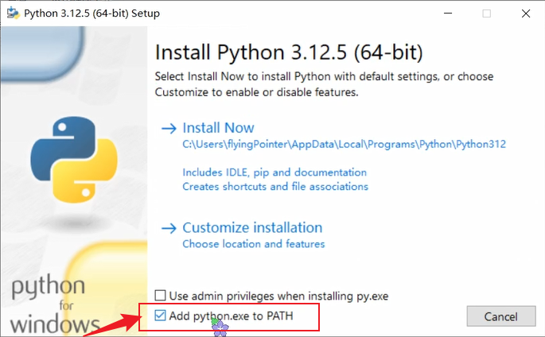

如果C盘空间较紧张，可以更改安装路径，如下图所示；本文中介绍的其他软件在安装过程中也可以改变安装路径，下文不再赘述。其余选项保持默认选择即可。


完成安装后，按键 `Win + R` 调出"运行"窗口，在其中输入 `cmd` 调出命令行终端，如下图所示。


在终端键入命令 `python`，若返回Python版本信息（本教程以`3.12.5`版本为例）以及交互界面，如下图所示，则Python解释器成功安装。

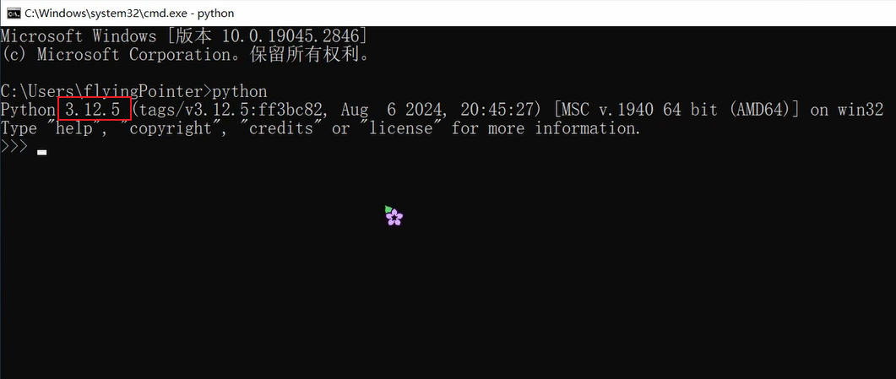

除了交互式界面，我们也可以在附带的IDLE中撰写和运行代码，但IDLE在代码调试、跨平台支持、插件系统等方面有所不足。除了IDLE之外，我们还可以选择在其他软件中编写和运行Python程序，如VSCode、Pycharm等。下面以VSCode为例进行演示。

## 2. 在 VSCode 中运行 Python 程序

VSCode全称Visual Studio Code，是一个由微软开发的免费、开源的代码编辑器，可以通过插件系统支持Python等多种编程语言，具有跨平台、轻量级、智能代码补全、代码高亮和格式化、扩展插件丰富等优点。

我们可以从VScode的官网下载其安装包，其官网链接为：[https://code.visualstudio.com/](https://code.visualstudio.com/)

同样地，网站默认会根据当前的操作系统给出下载链接；也可点击"other platforms"选择其他操作系统的安装包。这里仍然以Windows系统为例进行演示。

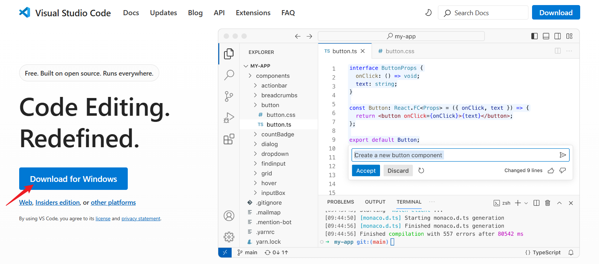

下载完成后，双击安装包进行安装。在安装过程中，建议勾选此处的两项"通过Code打开"，以便在文件资源管理器中右键快速打开VSCode，如下图所示；其余保持默认选项即可。

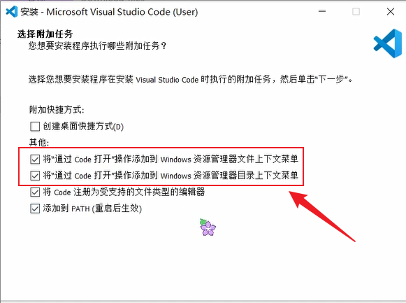

完成VSCode安装后，在任意目录中的空白处右键，选择"通过Code打开"，即可在VSCode中打开当前目录。例如，新建一个名为`hello_python`的目录，并通过VSCode打开此目录。


接下来，我们在VScode中编写和运行第一个Python程序。首先，我们需要安装Python插件。点击左侧边栏的"Extensions"（扩展插件），搜索"python"并点击"install"进行安装。


安装完成后，点击左侧边栏的"Explorer"（文件系统），右键点击"New File"（新建文件），如下图所示。


新的文件扩展名需为`.py`，例如新建一个名为`hello.py`的文件，然后输入下面的代码：

```python
print('Hello world!')
```

保存文件（快捷键 Ctrl + S）后，点击右上角的三角按钮（Run Python File），即可运行当前的Python程序，如下图所示。


若程序顺利运行并在下方终端正确输出"Hello world!"，如下图所示，则说明通过VSCode顺利地搭建了Python编程环境！


## 补充说明0：视频教程

上述Python环境配置步骤也可以参考对应的视频，其播放链接为：[https://www.bilibili.com/video/BV1GxWQenEso/](https://www.bilibili.com/video/BV1GxWQenEso/)


## 补充说明1：MacOS系统下Python环境配置问题说明

### 1.1 快捷键对应关系

上文中提到的快捷键中，`Ctrl`键对应MacOS中的`Command`键。

### 1.2 终端调出方式

在MacOS系统中，可以通过 `Command + 空格` 首先调出聚焦搜索，然后在其中搜索 `terminal` 并打开，即可打开终端。

### 1.3 VSCode打开目录的方法

在MacOS版本的VSCode安装过程中，可能不会提供"通过Code打开"的勾选选项，导致无法通过右键在Code中打开当前目录。一种等效的替代方法是，先打开VSCode，然后点击"File"，从中选择"Open Folder"，然后选择文件夹打开。

此外，注意在MacOS系统下的软件安装过程中，最终需将软件拖动到Applications（"应用"）文件夹。


## 补充说明2：VSCode界面汉化设置

可以在VSCode的"Extensions"（扩展插件）中搜索"Chinese"，然后选择第一个搜索结果（插件名称：**Chinese (Simplified) (简体中文) Language Pack for Visual Studio Code**）进行安装，如下图所示。

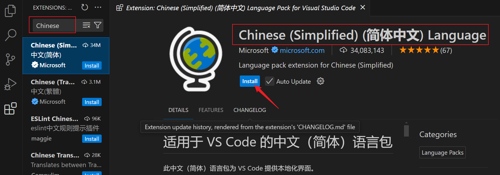

安装完成后，右下角会弹出提示框，点击"Change Language and Restart"（更改语言并重启）即可，如下图所示；重启之后，VSCode的菜单栏、侧边栏等都改变为简体中文显示。


## 补充说明3：在Pycharm中编写和运行Python程序

PyCharm是由JetBrains公司开发的一款专为Python语言设计的集成开发环境（IDE），也是Python开发者广泛使用的IDE之一。

> IDE（Integrated Development Environment，集成开发环境）是一个软件应用程序，它为编写、测试和调试代码提供了一个统一的界面。IDE通常包含代码编辑器、编译器或解释器、调试器、插件系统等关键组件。IDE的目的是提高开发效率，通过集成多种工具和功能，使开发者能够在一个环境中完成从编码到部署的全过程。

我们可以从Pycharm官网进行下载，其官网地址为：[https://www.jetbrains.com/pycharm/download/](https://www.jetbrains.com/pycharm/download/)

同样地，网站默认会根据当前的操作系统给出下载链接，如下图所示；也可选择其他操作系统的安装包。这里仍然以Windows系统为例进行演示。

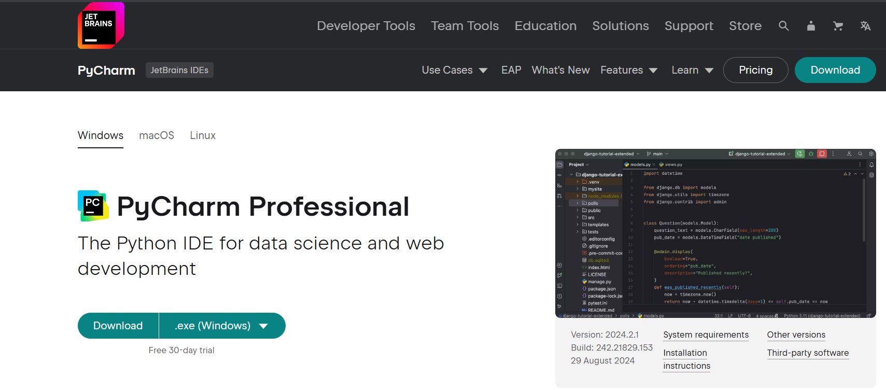

首先映入眼帘的是付费且功能更加完整的"PyCharm Professional"（专业版），我们向下卷动页面，找到功能较少、但足够用于Python编程的"Community Edition"（社区版），如下图所示；点击Download进行下载。两种版本的功能对比可参考此链接：[PyCharm Professional vs Community Edition](https://www.jetbrains.com/pycharm/editions/)。


下载完成后，双击安装包进行安装。在安装过程中，建议勾选下图圈画的两项，以便快捷地打开Pycharm。

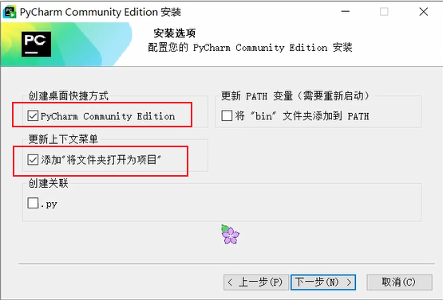

完成安装后，在任意目录中的空白处右键，选择"Open Folder as Pycharm Community Edition Project"（作为Pycharm项目打开目录），即可在Pycharm中打开当前目录。例如，新建一个名为`hello`的目录，并通过Pycharm打开此目录。

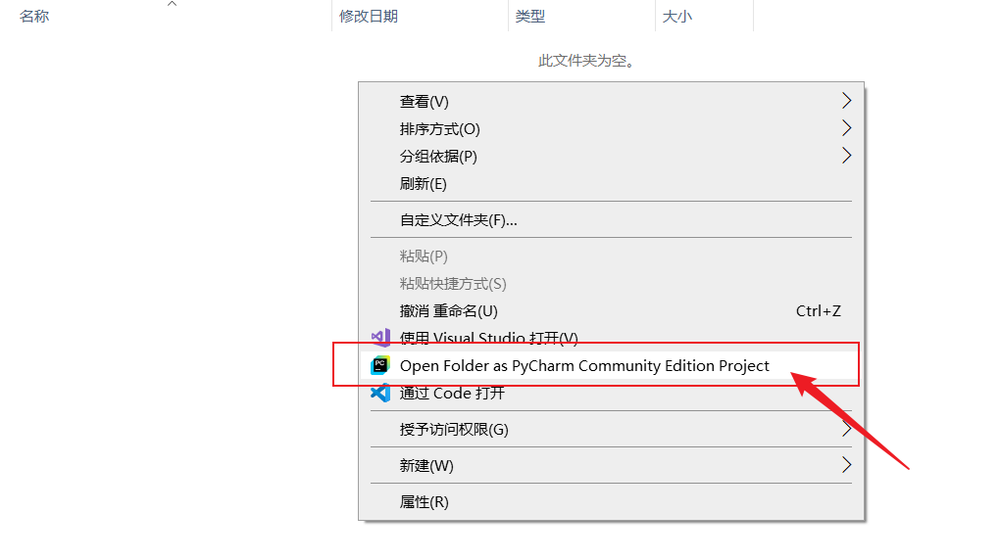

首次用Pycharm打开目录时，会弹出下图所示的提示框，点击"Trust Project"（信任项目）即可。

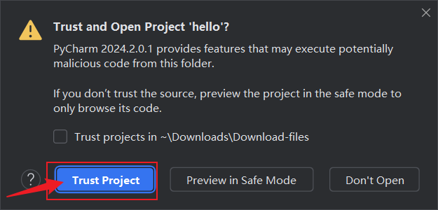

若首次打开空目录，Pycharm会自动生成一个名为`main.py`的Python脚本，并自动检索已安装的Python解释器。例如，若我们已根据上文安装了Python 3.12，则Pycharm界面的右下角会显示`Python 3.12`，如下图所示。

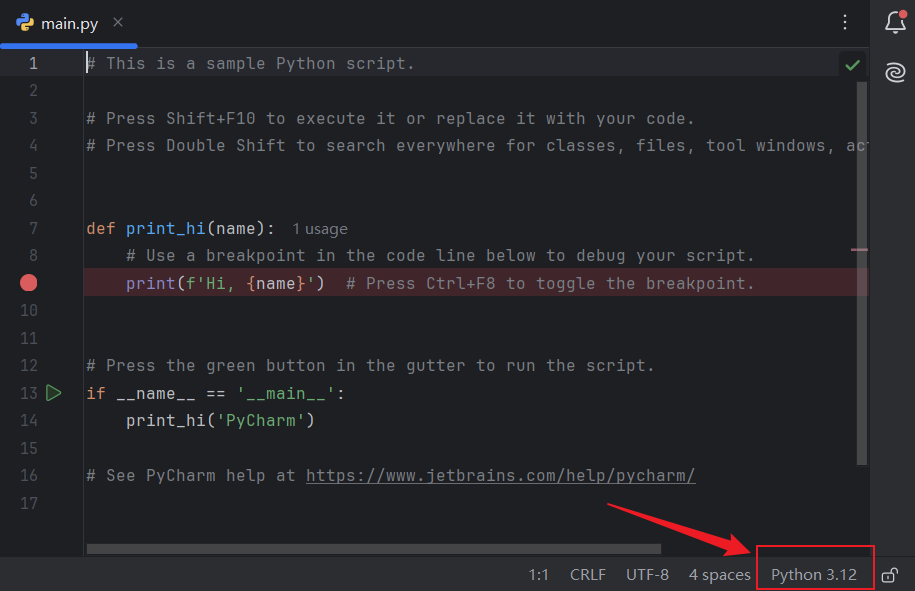

删除原有代码，输入下面的代码：

```python
print('Hello world!')
```

然后，点击右上角的三角符号即可运行Python程序，快捷键是"Shift + F10"，如下图所示。


同样地，若配置无误，我们可以看到下方的终端正确地输出了程序运行结果，如下图所示。


若需界面语言改为中文，可点击右上角的齿轮按钮，点击"Settings"进入设置界面。


点击"Plugins"（插件），然后搜索"Chinese"，确保插件"**Chinese (Simplified) Language Pack / 中文语言包**"已安装；若尚未安装，点击"install"进行安装。

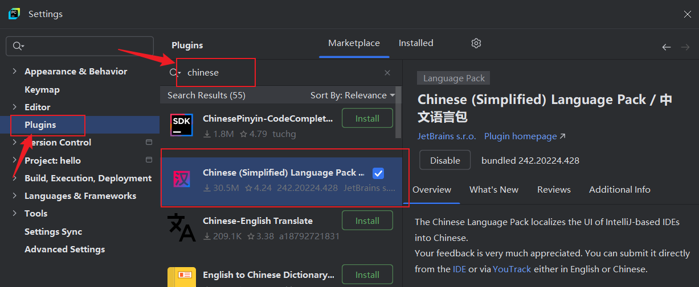

安装完成后，点击"Appearance & Behavior"，选择"System Settings"，选择其中的"Language and Region"，在"Language"（语言）一项中，从下拉选单中选择简体中文语言，如下图所示；然后点击"OK"即可。

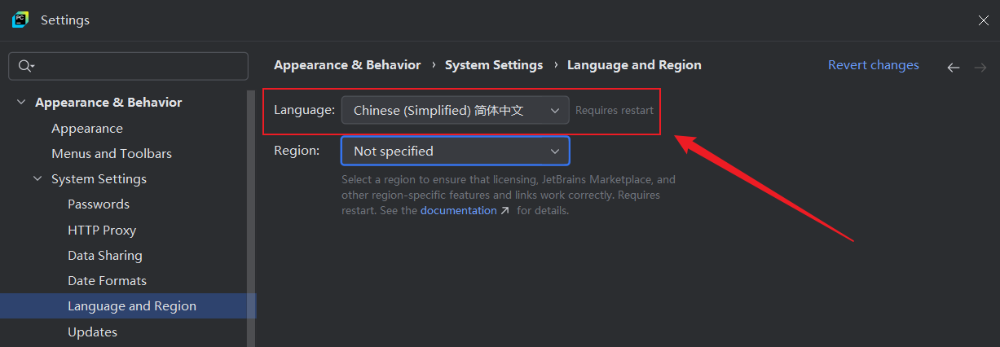

完成设置后，弹出重新启动的提示框，如下图所示；点击"Restart"（重启），则重新启动后Pycharm的界面语言即可更改为简体中文。


